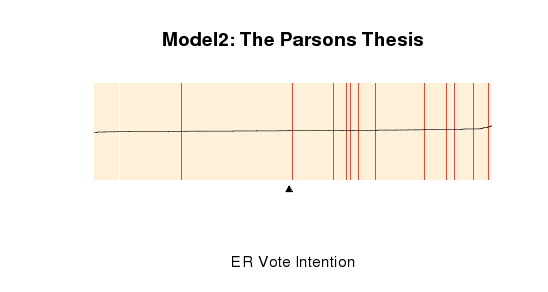
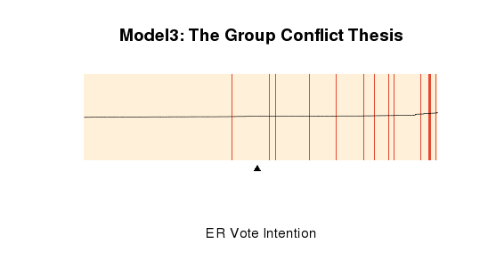

Our extension was inspired by Andreas Wimmer and Yuval Feinstein's 2010 paper "The Rise of the Nation-State Across the World, 1816-2001."  This paper seperately tests the prevailing explanatory theories of the rise of the nation-state as the dominant form of governance. Our extension takes a similar approach, testing the major theories of support for extreme right parties in the Western European context in separate models. We operationalize the variables in these theories using the available measures from the original data set.

In order to obtain a compelling visual representation of the predictive power of different theories and models, we use the method suggested in Brian Greenhill, Michael D. Ward and Audrey Sacks (2011) "The Separation Plot: A New Visual Method for Evaluating the Fit of Models with Categorical Outcomes",  American Journal of Political Science 55 (3): 1-13. We use their R package "separationplot".

Run necessary packages and load data (Source: Arzheimer dataverse)

```{r}


library(MASS)
library(nlme)
library(foreign)
library(dplyr)
library(broom)
library(ggplot2)
library(stargazer)
library(grid)
library(gridExtra)
library(separationplot)
library(Hmisc) 

data <- read.dta("nonimp.dta")

# Cleaning up data
data <- data %>%
  rename(ext_vote = rexvote,
         age_1 = age1, # (18–29 years)
         age_2 = age2, # (30–45 years)
         age_4 = age4, # (>65 years)
         edu_1 = mye1, # Education: middle/high
         edu_2 = mye2, # Education: university
         farmer_own = farmerown,
         left_right_scale = zlrs, # Left-Right Scale
         eu_neg = euschlecht, # Negative evaluation of EU membership of one's own country
         z_dem_satis = zsatisdmo, # Dissatisfied: Democracy
         dispro_elect = disp, # Disproportionality
         federalism = lfed1, # Decentralization
         z_asylumseeker = zasylumseekers,
         z_unemp = zsur, # Unemployment rate
         z_replacement = zreplacementrate, # Unemp benefits
         max_er = rmax) # Maximum toughness in extreme right discourse
```


# Preparing data for analysis

```{r}
# Create centered variables for Saliance and Variance based on grand mean centering according to author

data <- data  %>% 
  mutate(salience_mean_c = (salienzmean - 3.84568)) %>% 
  mutate(var_c = rvar - 21.75423)

# Make male variable numeric
data <- data %>%
  mutate(male = as.numeric(male))

# Create a dummy variable for country (transform from character to factor variable)
data <- data %>%
  mutate(country = factor(sortcountry, labels = c("AT", "BE","DE-E","DE-W","DK","ES","FI","FR","GR","IT","LU","NL","NO","PT","SE")))
```


# Model 1: Adorno Thesis (Individual Characteristics and Value Orientations)
The first model is based on Theodor Adorno's 1950 theory that support for extreme right parties (in his case, fascist parties) originates from supporters' personality traits and value orientations, which make individuals more receptive to the appeals of extreme right parties.  We operationalize "personality traits and value orientations" using the individual level characteristics from our data set: gender, age, occupation, marital status, and self-placement on a left-right scale. 

```{r}
model_1 <- glm(ext_vote ~ male + age_1 + age_2 + age_4 + edu_1 + edu_2 + farmer_own + worker + retired + unemployed + partner + left_right_scale + country - 1, data = data)
summary(model_1)
actual <- model_1$y # Create vector with actual values for vote intention for extreme right parties

log.odds <- model_1$fitted.values # Create a vector with log-odd values
# Create link function to transform log-odds into predicted probabilities
link <- function(log.odd) {
  pred.prob <- 1/(1+exp(-log.odd))
  pred.prob # returns a numeric vector of predicted probabilities
} 
pred_prob <- link(log.odds) # Transform log-odds into predicted probabilities
pred_prob <- as.vector(pred_prob) 
range(pred_prob) # variation in the predicted probabilities: very little variation.
# Graph variation in Predicted probabilities
pred_df <- data.frame(pred_prob)
ggplot(pred_df, aes(x = 1:length(pred_prob), y = pred_prob)) + 
  geom_line() +
  xlab("Prediction Number") +
  ylab("Predicted Probability") +
  ggtitle("Model 1: Variation in Predicted Probabilities")
# Create separation plot to visualize the predictive power of the model
separationplot(pred = pred_prob, actual = actual, type = "rect", heading = "Model1: The Adorno Thesis", xlab = "ER Vote Intention", newplot = F, line = T, lwd2 = 0.8, height = 0.5, show.expected = T) 
```


#Conclusion
There isn't a big range in the predicted probabilities of the model, therefore the predicted probabilities are not very helpful. Separation plot helps a lot to discern the predictive power of the model. As the events of extreme right vote intension increases as we move to the right (i.e. red lines cluster around the end of the graph), the model does a good job of estimating the likelihood of events. However, as the small arrow in the graph shows, the model predicts that half the number of observations will have the intention to vote for an extreme right party. The number of actual events (red lines) is much lower.  
```

# Model 2: Parsons Thesis (Social Disintegration)

Parsons' 1942 theory of social disintegration posits that anomia, a breakdown of social norms, and attendant feelings of anxiety, anger and isolation brings about a longing for strong leadership and rigid ideologies that extreme right parties can provide.  While we do not have measures for the emotions of participants in the studies whose data we use, in our second model we examine the relationship between extreme right voting and the kinds of sentiments about social change that Parsons refers to: satisfaction with democracy and the negative evaluation of the European Union.

```{r}
model_2 <- glm(ext_vote ~ eu_neg + z_dem_satis + country - 1, data = data)
summary(model_2)

actual <- model_2$y # Create vector with actual values for vote intention for extreme right parties
log.odds <- model_2$fitted.values # Create a function with log-odds
pred_prob <- link(log.odds) # Transform log-odds into predicted probabilities
pred_prob <- as.vector(pred_prob) 
range(pred_prob) # variation in the predicted probabilities: very little variation.
# Visualize variation in predicted probabilities
pred_df <- data.frame(pred_prob)
ggplot(pred_df, aes(x = 1:length(pred_prob), y = pred_prob)) + 
  geom_line() +
  xlab("Prediction Number") +
  ylab("Predicted Probability") +
  ggtitle("Model 2: Variation in Predicted Probabilities")
# Create separation plot to visualize the predictive power of the model
separationplot(pred = pred_prob, actual = actual, type = "rect", heading = "Model2: The Parsons Thesis", xlab = "ER Vote Intention", newplot = F, line = T, lwd2 = 0.8, height = 0.5, show.expected = T) 
```



#Conclusion:
Again, there is little variation in our predictive probabilities with this model. Similar to model 1, most events are aligned with higher predictive probabilities on the right hand of the graph. Yet Model 1 has slightly better predictive power as the very end of the graph is likely to be clustered with events rather than non-events as in Model 2. 

# Model 3: Group Conflict Model (Various theories)

Group conflict theories encompass a variety of theories.  Some emphasize the role of instrumental rationality, arguing that xenophobia results from a contest between immigrants and residents over scarce resources like jobs and welfare benefits. Others emphasize the scapegoating of immigrants as perceived threats to residents' status, power or resources.  In this last model, we use relevant variables representing both the availability of resources like jobs and welfare benefits and the prevalence of immigration: unemployment rates, unemployment benefits, number of asylum seekers, saliance and variance of right-wing issues.

We used interactions between contextual variables in this model in line with the author's original model.

```{r}
model_3 <- glm(ext_vote ~ z_asylumseeker + z_unemp + z_asylumseeker:z_unemp + z_replacement + z_replacement:z_unemp + z_replacement:z_asylumseeker + country - 1, data = data)

summary(model_3)
actual <- model_3$y # Create vector with actual values for vote intention for extreme right parties

log.odds <- model_3$fitted.values # Create a function with log-odds
pred_prob <- link(log.odds) # Transform log-odds into predicted probabilities
pred_prob <- as.vector(pred_prob) 
range(pred_prob) # variation in the predicted probabilities: very little variation.
# Visualize variation in predicted probabilities
pred_df <- data.frame(pred_prob)
ggplot(pred_df, aes(x = 1:length(pred_prob), y = pred_prob)) + 
  geom_line() +
  xlab("Prediction No") +
  ylab("Predicted Probability") +
  ggtitle("Model 3: Variation in Predicted Probabilities")
# Create separation plot to visualize the predictive power of the model
separationplot(pred = pred_prob, actual = actual, type = "rect", heading = "Model3: The Group Conflict Thesis", xlab = "ER Vote Intention", newplot = F, line = T, lwd2 = 0.8, height = 0.5, show.expected = T) 
```



#Conclusion:
The majority of events (the intention to vote for an extreme right party) is clustered at the right end of the model - which is in line with a good predictive model. However, in this model the distribution of events is very dispersed compared to the other two models.

All Three Models


Although there is very little difference in the separation plots for all three models, our conclusion is that model 1 (the Adorno thesis which emphasizes individual-level characteristics and personal attitudes) has the most predictive power given the level of concentration of events in the upper probabilities area in the plot.

This extension breaks Arzheimer's multi-level model into three different models that correspond to the three theoretical explanations for political orientation towards extreme right parties and movements. While we were interested in visualizing the predictive power of each theory, we acknowledge that the original model's multi-level structure (individuals nested into election contexts in various countries) is a better way to analyze ER vote intension. That said, we think treating each country as another level that the election contexts are nested in (rather than taking countries as dummy variables) would have provided an even more compelling multi-level model.    