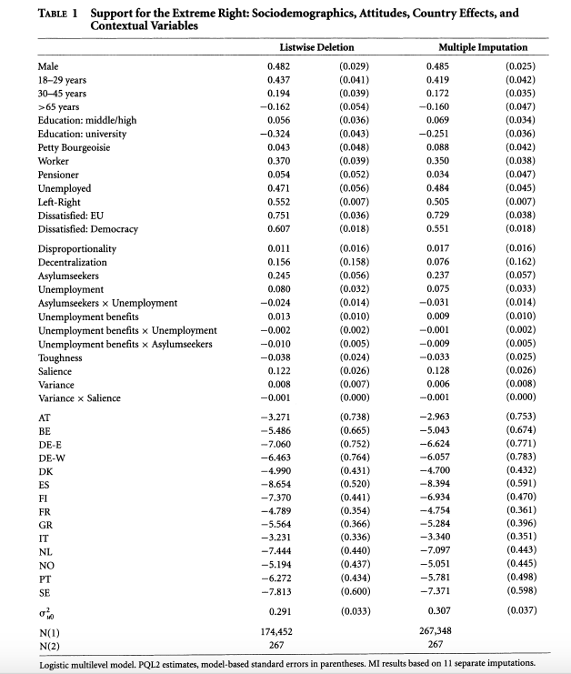
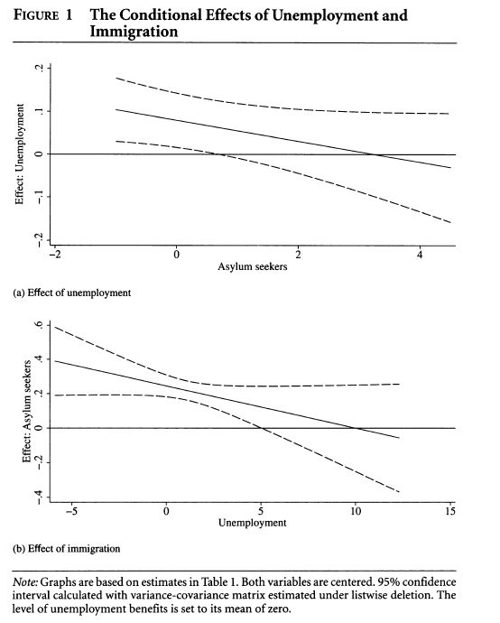
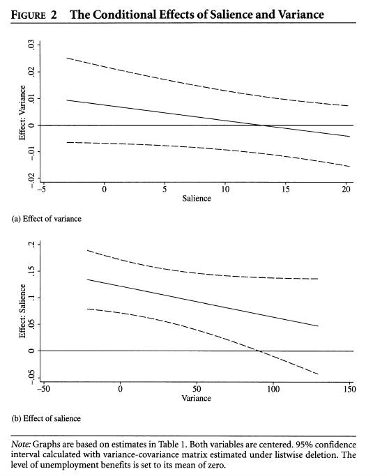
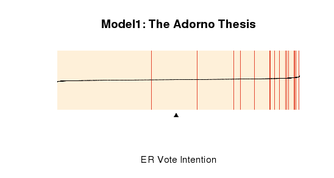
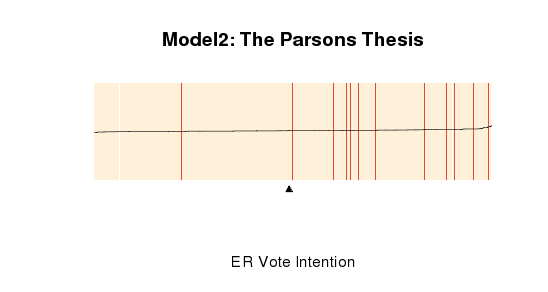
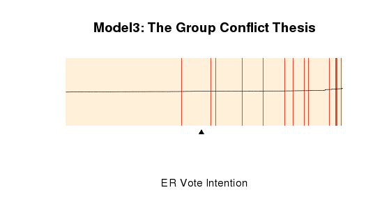

# Replication Code for "Contextual Factors and the Extreme Right Vote in Europe, 1980-2002" by Kai Arzheimer American Journal of Political Science (2009)

Note: Our regression values are slightly different from the authors as his stata code used a slightly different method than our function (glmmPQL) to calculate Penalized Quasi-likehood. Finally, we were unfortunately not able to reproduce the last two figures that showed the joint impact of more than 2 variables.

#The paper
Kai Arzheimer, "Contextual Factors and the Extreme Right Vote in Western Europe, 1980-2002"25548117.pdf
This article attempts to answer the “twin question of why the extreme right support is so unstable within many countries over time, and why these parties are so weak in many West European countries.” The author conduct a multi-level analysis, combining data on macro-level contextual variables (unemployment, immigration, and welfare benefits) with individual-level variables (sociodemographic factors and attitudes). It concludes that although the contextual factors are positively correlated with the intention to vote for an extreme-right party, they don't seem to reinforce each other (i.e. as unemployment levels rise, the effect of immigration does not increase but rather declines).

#The data
Individual-level variables come from Eurobarometer surveys (1980-2002), while contextual variables are gathered from a number of different data sets produced by the OECD, UNHCR etc. The merged data and the Stata code are available through the author’s dataverse at: http://hdl.handle.net/1902.1/12092. 

#The model 
The article uses a multi-level logistic model via Penalized Quasi-Likelihood. The dependent variable is vote intention for an extreme right party, which is assumed to be binomially distributed.

# Run necessary packages and load data (Source: Arzheimer dataverse)

```{r}


library(MASS)
library(nlme)
library(xtable)
library(foreign)
library(dplyr)
library(broom)
library(ggplot2)
library(xtable)
library(stargazer)
library(grid)
library(gridExtra)

data <- read.dta("nonimp.dta")

# Cleaning up data
data <- rename(data, ext_vote = rexvote)
data <- rename(data, age_1 = age1) # (18–29 years)
data <- rename(data, age_2 = age2) # (30–45 years)
data <- rename(data, age_4 = age4) # (>65 years)
data <- rename(data, edu_1 = mye1) # Education: middle/high
data <- rename(data, edu_2 = mye2) # Education: university
data <- rename(data, farmer_own = farmerown) 
data <- rename(data, left_right_scale = zlrs) # Left-Right Scale
data <- rename(data, eu_neg = euschlecht) # Negative evaluation of EU membership of one's own country
data <- rename(data, z_dem_satis = zsatisdmo) # Dissatisfied: Democracy
data <- rename(data, dispro_elect = disp) # Disproportionality
data <- rename(data, federalism = lfed1) # Decentralization
data <- rename(data, z_asylumseeker = zasylumseekers) 
data <- rename(data, z_unemp = zsur) # Unemployment rate
data <- rename(data, z_replacement = zreplacementrate) # Unemp benefits
data <- rename(data, max_er = rmax) # Maximum toughness in extreme right discourse

```


# Preparing data for analysis

```{r}
# Create centered variables for Saliance and Variance based on grand mean centering according to author

data <- data  %>% 
  mutate(salience_mean_c = (salienzmean - 3.84568)) %>% 
  mutate(var_c = rvar - 21.75423)

# Make male variable numeric
data <- data %>%
  mutate(male = as.numeric(male))

# Create a dummy variable for country (transform from character to factor variable)
data <- data %>%
  mutate(country = factor(sortcountry, labels = c("AT", "BE","DE-E","DE-W","DK","ES","FI","FR","GR","IT","LU","NL","NO","PT","SE")))
```

# Run the regression (multilevel logictic regression based on Quasi-penalized likelihood): All contextual variables are standardized mean-centered (as connoted by "z-")

```{r}
model <- glmmPQL(ext_vote ~ male + age_1 + age_2 + age_4 + edu_1 + edu_2 + farmer_own + worker + retired + unemployed + left_right_scale + eu_neg + z_dem_satis + dispro_elect + federalism + z_asylumseeker + z_unemp + z_asylumseeker:z_unemp + z_replacement + z_replacement:z_unemp + z_replacement:z_asylumseeker + max_er + salience_mean_c + var_c + var_c:salience_mean_c + country - 1, random = ~1|kontext, family = binomial(link = "logit"), data = data, verbose = TRUE)
# summary(model) # Output too long
```


# Table 1

```{r}
# Create vectors of coefficients, standard deviations, and variable names

coefficient <- as.vector(model$coef$fixed) 
n <- c(174452, 267)
stand_dev <- as.vector(sqrt(diag(model$varFix))) 

# Create matrix of coefficients and standard deviations.

table_matrix <- cbind(coefficient, stand_dev)

# Label matrix.

rownames(table_matrix) <- c("Male","18_29 years","30_45 years",">65 years","Education: middle/high","Education: university","Petty Bourgeoisie","Worker","Pensioner","Unemployed","Left-Right","Dissatisfied: EU","Dissatisfied: Democracy","Disproportionality","Decentralization","Asylumseekers", "Unemployment", "Asylumseekers x Unemployment", "Toughness", "Salience", "Variance", "AT", "BE", "DE-E", "DE-W", "DK", "ES", "FI", "FR", "GR", "IT", "NL", "NO", "PT", "SE", "Asylumseekers x Unemployment", "Unemployment benefits x Unemployment", "Unemployment benefits x Asylumseekers", "Variance x Salience")

# Create Table 1 with stargaze

table_1 <- stargazer(table_matrix, title = "TABLE 1 Support for the Extreme Right: Sociodemographics, Attitudes, Country Effects, and Contextual Variables", align = TRUE, table.layout = "t", notes = "Logistic multilevel model. PQL2 estimates and model-based standard errors.", style = "ajps", out = "Table 1.html", no.space = TRUE)

```

# Figure 1 (Conditonal Effects of Unemployment and Immigration)

```{r}
library(msm)
asy <- seq(from = min(data$z_asylumseeker), to = max(data$z_asylumseeker), by = .01) # vector with possible values for asylumseekers

variable <- asy # identifying "asy" as the variable of interest so that the remaining code can be reused in the next graph with a different variable of interest specified
slopes <- model$coef$fixed["z_unemp"] + model$coef$fixed["z_asylumseeker:z_unemp"] * asy # Estimated slopes based on estimated coefficients of unemployment (17) and unemployment x immigration (36)
estmean <- model$coef$fixed # Estimated means for each variable 
estvar <- vcov(model) # Estimated covariances
se <- rep(NA, length(variable)) # Creating empty vector for predicted s.e. values
# Creating a loop using the deltamethod function which approximates standard errors of transformation of parameters based on the given estimates of the mean and covariance (~ bootstrapping).
for (i in 1:length(variable)) {
  j <- variable[i]
  se[i] <- deltamethod (~ (x17) + (x36) * j, estmean, estvar)
}

# Create confidence intervals and combine all values in matrix.
upper <- slopes + 1.96 * se
lower <- slopes - 1.96 * se
variable.data <- cbind(variable, slopes, upper, lower)

# Creating the first graph with ggplot

variable.data <- data.frame(variable.data) # Turn matrix into data frame so that ggplot can read it.
xtitle <- "Asylumseekers"
ytitle <- "Effect: Unemployment"
main <- "Figure 1: The Conditional Effects of Unemployment and Immigration"
graph_1 <- ggplot(variable.data, aes(x = variable, y = slopes)) + 
  geom_line(aes(y = slopes), color = "blue") + 
  geom_ribbon(aes(ymin = lower, ymax = upper), alpha = 0.2) + 
  geom_hline(yintercept = 0, size = 0.4, color = "black") +
  labs(x = xtitle, y = ytitle, title = main) +
  coord_fixed(ratio = 8)

#Figure 1, graph 2

unemployment <- seq(from = min(data$z_unemp), to = max(data$z_unemp), by = .01) # vector with possible values for unemployment
variable <- unemployment # standardized label
slopes <- model$coef$fixed["z_asylumseeker"] + model$coef$fixed["z_asylumseeker:z_unemp"] * variable # Estimated slopes based on estimated coefficients of asylumseekers (16) and unemployment x immigration (36)
estmean <- model$coef$fixed # Estimated means for variables 
estvar <- vcov(model) # Estimated covariances
se <- rep(NA, length(variable)) # Creating empty vector for predicted s.e. values
# Creating a loop with deltamethod to calculate estimated standard errors
for (i in 1:length(variable)) {
  j <- variable[i]
  se[i] <- deltamethod (~ (x16) + (x36) * j, estmean, estvar)
}
# Create confidence intervals and combine all values in matrix.
upper <- slopes + 1.96 * se
lower <- slopes - 1.96 * se
variable.data <- cbind(variable, slopes, upper, lower)

# Creating the second graph with ggplot:

variable.data <- data.frame(variable.data) # Turn matrix into data frame so that ggplot can read it.
xtitle <- "Unemployment"
ytitle <- "Effect: Asylum seekers"
main <- "The Conditional Effects of Unemployment and Immigration"
graph_2 <- ggplot(variable.data, aes(x = variable, y = slopes)) + 
  geom_line(aes(y = slopes), color = "blue") + 
  geom_ribbon(aes(ymin = lower, ymax = upper), alpha = 0.2) + 
  geom_hline(yintercept = 0, size = 0.4, color = "black") +
  labs(x = xtitle, y = ytitle) +
  coord_fixed(ratio = 12)

# Figure 1 with ggplot

grid.arrange(graph_1, graph_2, ncol = 1)

# Plot separately - better scaled
graph_1
graph_2

```

# Figure 2 (Conditonal Effects of Salience and Variance)


```{r}
# Figure 2, graph 1
# Create vector with possible values for salience
salience <- seq(from = min(data$salience_mean_c), to = max(data$salience_mean_c), by = .1) 
variable <- salience
slopes <- model$coef$fixed["var_c"] + model$coef$fixed["salience_mean_c:var_c"] * variable # Estimated slopes based on estimated coefficients of salience (21) and salience x variance (39)
estmean <- model$coef$fixed # Estimated means for variables 
estvar <- vcov(model) # Estimated covariances
se <- rep(NA, length(variable)) # Creating empty vector for predicted s.e. values
# Creating a loop with deltamethod to calculate estimated standard errors
for (i in 1:length(variable)) {
  j <- variable[i]
  se[i] <- deltamethod (~ (x21) + (x39)*j, estmean, estvar)
}
# Create confidence intervals and combine all values in matrix.
upper <- slopes + 1.96*se
lower <- slopes - 1.96*se
variable.data <- cbind(variable, slopes, upper, lower)

# Creating the first graph with ggplot:

variable.data <- data.frame(variable.data) # Turn matrix into data frame so that ggplot can read it.
xtitle <- "Salience"
ytitle <- "Effect: Variance"
main <- "The Conditional Effects of Salience and Variance"
graph_3 <- ggplot(variable.data, aes(x = variable, y = slopes)) + 
  geom_line(aes(y = slopes), color = "blue") + 
  geom_ribbon(aes(ymin = lower, ymax = upper), alpha = 0.2) + 
  geom_hline(yintercept = 0, size = 0.4, color = "black") +
  labs(x = xtitle, y = ytitle, title = main) +
  coord_fixed(ratio = 400)

# Second part of Figure 2:

variance <- seq(from = min(data$var_c), to = max(data$var_c), by=10) # vector with possible values for variance
variable <- variance
slopes <- model$coef$fixed["salience_mean_c"] + model$coef$fixed["salience_mean_c:var_c"] * variable # Estimated slopes based on estimated coefficients of salience (20) and salience x variance (39)
estmean <- model$coef$fixed # Estimated means for variables 
estvar <- vcov(model) # Estimated covariances
se <- rep(NA, length(variable)) # Creating empty vector for predicted s.e. values
# Creating a loop with deltamethod to calculate estimated standard errors

for (i in 1:length(variable)) {
  j <- variable[i]
  se[i] <- deltamethod (~ (x20) + (x39) * j, estmean, estvar)
}
# Create confidence intervals and combine all values in matrix.
upper <- slopes + 1.96 * se
lower <- slopes - 1.96 * se
variable.data <- cbind(variable, slopes, upper, lower)

# Creating the second graph with ggplot:

variable.data <- data.frame(variable.data) # Turn matrix into data frame so that ggplot can read it.
xtitle <- "Variance"
ytitle <- "Effect: Salience"
main <- "The Conditional Effects of Salience and Variance"
graph_4 <- ggplot(variable.data, aes(x = variable, y = slopes)) + 
  geom_line(aes(y = slopes), color = "blue") + 
  geom_ribbon(aes(ymin = lower, ymax = upper), alpha = 0.2) + 
  geom_hline(yintercept = 0, size = 0.4, color = "black") +
  labs(x = xtitle, y = ytitle, title = main) +
  coord_fixed(ratio = 500)

grid.arrange(graph_3, graph_4, ncol = 1)
# Better scaled versions - not combined
graph_3
graph_4
```

# EXTENSION

Our extension was inspired by Andreas Wimmer and Yuval Feinstein's 2010 paper "The Rise of the Nation-State Across the World, 1816-2001."  This paper seperately tests the prevailing explanatory theories of the rise of the nation-state as the dominant form of governance. Our extension takes a similar approach, testing the major theories of support for extreme right parties in the Western European context in separate models. We operationalize the variables in these theories using the available measures from the original data set.

In order to obtain a compelling visual representation of the predictive power of different theories and models, we use the method suggested in Brian Greenhill, Michael D. Ward and Audrey Sacks (2011) "The Separation Plot: A New Visual Method for Evaluating the Fit of Models with Categorical Outcomes",  American Journal of Political Science 55 (3): 1-13. We use their R package "separationplot".

Run necessary packages and load data (Source: Arzheimer dataverse)

```{r}


library(MASS)
library(nlme)
library(xtable)
library(foreign)
library(dplyr)
library(broom)
library(ggplot2)
library(xtable)
library(stargazer)
library(grid)
library(gridExtra)

data <- read.dta("nonimp.dta")

# Cleaning up data
data <- rename(data, ext_vote = rexvote)
data <- rename(data, age_1 = age1) # (18–29 years)
data <- rename(data, age_2 = age2) # (30–45 years)
data <- rename(data, age_4 = age4) # (>65 years)
data <- rename(data, edu_1 = mye1) # Education: middle/high
data <- rename(data, edu_2 = mye2) # Education: university
data <- rename(data, farmer_own = farmerown) 
data <- rename(data, left_right_scale = zlrs) # Left-Right Scale
data <- rename(data, eu_neg = euschlecht) # Negative evaluation of EU membership of one's own country
data <- rename(data, z_dem_satis = zsatisdmo) # Dissatisfied: Democracy
data <- rename(data, dispro_elect = disp) # Disproportionality
data <- rename(data, federalism = lfed1) # Decentralization
data <- rename(data, z_asylumseeker = zasylumseekers) 
data <- rename(data, z_unemp = zsur) # Unemployment rate
data <- rename(data, z_replacement = zreplacementrate) # Unemp benefits
data <- rename(data, max_er = rmax) # Maximum toughness in extreme right discourse

```


# Preparing data for analysis

```{r}
# Create centered variables for Saliance and Variance based on grand mean centering according to author

data <- data  %>% 
  mutate(salience_mean_c = (salienzmean - 3.84568)) %>% 
  mutate(var_c = rvar - 21.75423)

# Make male variable numeric
data <- data %>%
  mutate(male = as.numeric(male))

# Create a dummy variable for country (transform from character to factor variable)
data <- data %>%
  mutate(country = factor(sortcountry, labels = c("AT", "BE","DE-E","DE-W","DK","ES","FI","FR","GR","IT","LU","NL","NO","PT","SE")))
```


# Model 1: Adorno Thesis (Personality Traits and Value Orientations)
The first model is based on Theodor Adorno's 1950 theory that support for extreme right parties (in his case, fascist parties) originates from supporters' personality traits and value orientations, which make individuals more receptive to the appeals of extreme right parties.  We operationalize "personality traits and value orientations" using the individual level characteristics from our data set: gender, age, occupation, marital status, and self-placement on a left-right scale. 

```{r}
library(separationplot)
library(Hmisc) 

model_1 <- glm(ext_vote ~ male + age_1 + age_2 + age_4 + edu_1 + edu_2 + farmer_own + worker + retired + unemployed + partner + left_right_scale + country - 1, data = data)
summary(model_1)
actual <- model_1$y # Create vector with actual values for vote intention for extreme right parties

log.odds <- model_1$fitted.values # Create a vector with log-odd values
# Create link function to transform log-odds into predicted probabilities
link <- function(P) {
  1/(1+exp(-P))
} 
pred <- link(log.odds) # Transform log-odds into predicted probabilities
pred <- as.vector(pred) 
range(pred) # variation in the predicted probabilities: very little variation.
dev.off()
# Create separation plot to visualize the predictive power of the model
separationplot(pred = pred, actual = actual, type = "rect", heading = "Model1: The Adorno Thesis", xlab = "ER Vote Intention", newplot = F, line = T, lwd2 = 0.8, height = 0.5, show.expected = T) 
```



#Conclusion
There isn't a big range in the predicted probabilities of the model, therefore the predicted probabilities are not very helpful. Separation plot helps a lot to discern the predictive power of the model. As the events of extreme right vote intension increases as we move to the right (i.e. red lines cluster around the end of the graph), the model does a good job of estimating the likelihood of events. However, as the small arrow in the graph shows, the model predicts that half the number of observations will have the intention to vote for an extreme right party. The number of actual events (red lines) is much lower.  

```

# Model 2: Parsons Thesis (Social Disintegration)

Parsons' 1942 theory of social disintegration posits that anomia, a breakdown of social norms, and attendant feelings of anxiety, anger and isolation brings about a longing for strong leadership and rigid ideologies that extreme right parties can provide.  While we do not have measures for the emotions of participants in the studies whose data we use, in our second model we examine the relationship between extreme right voting and the kinds of sentiments about social change that Parsons refers to: satisfaction with democracy and the negative evaluation of the European Union.


```{r}
model_2 <- glm(ext_vote ~ eu_neg + z_dem_satis + country - 1, data = data)
summary(model_2)

actual <- model_2$y # Create vector with actual values for vote intention for extreme right parties

log.odds <- model_2$fitted.values # Create a function with log-odds
# Create link function to transform log-odds into predicted probabilities
link <- function(P) {
  1/(1+exp(-P))
} 
pred <- link(log.odds) # Transform log-odds into predicted probabilities
pred <- as.vector(pred) 
range(pred) # variation in the predicted probabilities: very little variation.
dev.off()
# Create separation plot to visualize the predictive power of the model
separationplot(pred = pred, actual = actual, type = "rect", heading = "Model2: The Parsons Thesis", xlab = "ER Vote Intention", newplot = F, line = T, lwd2 = 0.8, height = 0.5, show.expected = T) 
```



#Conclusion:
Again, there is little variation in our predictive probabilities with this model. Similar to model 1, most events are aligned with higher predictive probabilities on the right hand of the graph. Yet Model 1 has slightly better predictive power as the very end of the graph is likely to be clustered with event than non-events as in Model 2. 

```

# Model 3: Group Conflict Model (Various theories)

Group conflict theories encompass a variety of theories.  Some emphasize the role of instrumental rationality, arguing that xenophobia results from a contest between immigrants and residents over scarce resources like jobs and welfare benefits. Others emphasize the scapegoating of immigrants as perceived threats to residents' status, power or resources.  In this last model, we use relevant variables representing both the availability of resources like jobs and welfare benefits and the prevalence of immigration: unemployment rates, unemployment benefits, number of asylum seekers, saliance and variance of right-wing issues.

```{r}
model_3 <- glm(ext_vote ~ z_asylumseeker + z_unemp + z_asylumseeker:z_unemp + z_replacement + z_replacement:z_unemp + z_replacement:z_asylumseeker + country - 1, data = data)

summary(model_3)
actual <- model_3$y # Create vector with actual values for vote intention for extreme right parties

log.odds <- model_3$fitted.values # Create a function with log-odds
# Create link function to transform log-odds into predicted probabilities
link <- function(P) {
  1/(1+exp(-P))
} 
pred <- link(log.odds) # Transform log-odds into predicted probabilities
pred <- as.vector(pred) 
range(pred) # variation in the predicted probabilities: very little variation.
dev.off()
# Create separation plot to visualize the predictive power of the model
separationplot(pred = pred, actual = actual, type = "rect", heading = "Model3: The Group Conflict Thesis", xlab = "ER Vote Intention", newplot = F, line = T, lwd2 = 0.8, height = 0.5, show.expected = T) 
```



#Conclusion:
The majority of events (intention to vote for ER) are clustered at the end right end of the model - which is in line with a good predictive model. However, in this model the distribution of events is very dispersed compared to other two models.

All Three Models


Although there is very little difference in the separation plots for all three models, our conclusion is that model 1 (the Adorno thesis which emphasizes individual-level characteristics and personal attitudes) has the most predictive power. 

